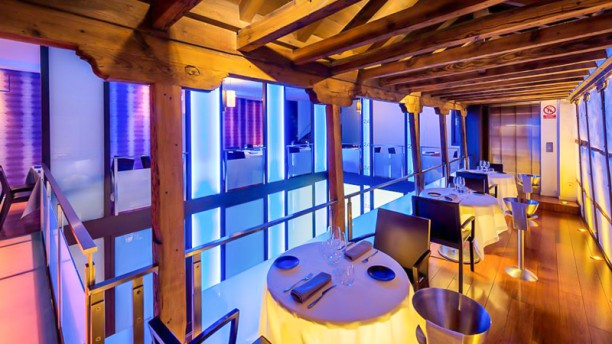

<style>
.list-group-item.active, .list-group-item.active:focus, .list-group-item.active:hover {
    background-color: #EA5933;
}
</style>

<style>
.nav>li>a {
    position: relative;
    display: block;
    padding: 10px 15px;
    color: #EA5933;
    font-weight: bold;
}
.nav-pills>li.active>a, .nav-pills>li.active>a:hover, .nav-pills>li.active>a:focus {
    color: white;
    background-color: #EA5933;
}
</style>


<script> 
    $(document).ready(function() { 
    $head = $('#header'); 
    $head.prepend('<A href = https://www.cuttingedge-events.com></A>') 
    }); 
</script> 


```{r echo=FALSE, message=FALSE,warning=FALSE}
library(readxl)
library(dplyr)
library(knitr)
```

# ACCOMMODATION

## Main Hotel: Meliá Palacio de los Duques

<iframe src="Meliá Palacio Duques/Meliá Palacio Duques.html" frameborder="0" width="100%" height="1380" scrolling="no"></iframe>

<iframe width="100%" height="480" src="https://www.youtube.com/embed/SJkxb-EkCek" frameborder="0" allow="accelerometer; encrypted-media; gyroscope; picture-in-picture" allowfullscreen></iframe>

<div class="budget">

<p> Accomodation. 
  <ul>
   Twin room. Rates per room per night. Including breakfast buffet: 381€ per night VAT inc.
   
   Double room for a single use (VIP). Rates per room per night: 341€ per night VAT inc.
  </ul>
</p>
<p> F&B. 
  <ul>
   Lunch / dinner menu: rates from 55€ per person.
  </ul>
</p>

</div>

<style>

.budget{
background-color: #607D8B;
color: white;
padding: 10px;
border: 1px solid black;
margin-left: 5px;
border-radius: 5px;
font-style: italic;
}
</style>

## Alternative Hotels {.tabset .tabset-fade .tabset-pills}

### Hotel Wellington 

<iframe src="Wellington/Wellington.html" frameborder="0" width="100%" height="1280" scrolling="no"></iframe>

<iframe width="100%" height="488" src="https://www.youtube.com/embed/jtadkmaluDE" frameborder="0" allow="accelerometer; encrypted-media; gyroscope; picture-in-picture" allowfullscreen></iframe>

<div class="budget">

<p> Accomodation. 
  <ul>
   Twin room. Rates per room per night. Including breakfast buffet: 245€ per night VAT inc.
   
   Double room for a single use. Rates per room per night: 230€ per night VAT inc.
  </ul>
</p>
<p> F&B. 
  <ul>
   Lunch  menu: rates from 56€ per person VAT incl.
   
   Dinner menu: rates from: 65€ per person VAT incl.
   
   Gala menu: rates from 99€ per person VAT incl.
  </ul>
</p>

</div>

<style>

.budget{
background-color: #607D8B;
color: white;
padding: 10px;
border: 1px solid black;
margin-left: 5px;
border-radius: 5px;
font-style: italic;
}
</style>

### Hotel Catalonia Gran Via

<iframe src="CataloniaGranVia/CataloniaGranVia.html" frameborder="0" width="100%" height="1250" scrolling="no"></iframe>

<div class="budget">

<p> Accomodation. 
  <ul>
   Twin room. Rates per room per night. Including breakfast buffet: 232€ per night VAT inc.
   
   Double room for a single use (VIP). Rates per room per night: 200€ per night VAT inc.
  </ul>
</p>
<p> F&B. 
  <ul>
   Lunch / dinner menu: rates from 45€ per person.
  </ul>
</p>

</div>

<style>

.budget{
background-color: #607D8B;
color: white;
padding: 10px;
border: 1px solid black;
margin-left: 5px;
border-radius: 5px;
font-style: italic;
}
</style>


# MAP

<iframe src="https://www.google.com/maps/d/u/0/embed?mid=1yZMGyyWMhhlKrp-teU64QX9QRmDpqVsS" width="100%" height="480"></iframe>

</br>

# SUGGESTED ACTIVITIES{.tabset .tabset-fade .tabset-pills}

## Las Rozas village shopping experience

Las Rozas Village is the main shopping spot in Madrid.This shopping center features more than 160 shops and more than 180 clothing brands! As La Roca Village in Barcelona, this place is also a large street simulating an samll town, full of small squares with trees and *small houses* filled with all kind of clothes! Besides the shopping experience it is also a claim for the tourists because as we told, it is a really nice place to visit and shopping!

*Clients will have at disposal a personal shopper. They will be able to ask for some advises or where the shops are located!*

After the visiting and shopping we will  go to lunch at restaurant X

* **Location** Las Rozas, Madrid 
* **Duration** 5 hours  
* **Capacity** No capacity defined
* **Included** Bus at disposal for the activity, English speaking assistance, VIP discounts at shops, glass of cava, personal shopper and lunch at Café y Tapas.


<br>

<div class="budget">

<p> Including. 
  <ul>
   Russian speaking assistance: 350€ VAT incl.
   
   Bus at disposal 5 hours for Las Rozas Village shopping experience: 400€ VAT incl.
   
   Lunch at Café y Tapas restaurant. Rates from: 35€ VAT incl. 
   
   Personal shopper at Las Roza. Depending on the time and day. Estimated rate: 700€ VAT incl. 
   
   Welcome drink (glass of cava): To be confirmed
</p>

</div>

## Toledo and Cigarral winery visit

Toledo's is one of the Spanish cities with the greatest wealth of monuments. Known as the city of the "three cultures" because Christians, Arabs and Jews lived together there for centuries. Behind its walls Toledo preserves an artistic and cultural legacy. 
The group will visit two of these monuments, which are The Toledo's mosque and the Sinagogue. 


After visiting the city of Toledo and walking around we will go for the lunch at restaurant Alfileritos 24, a restaurant located in the historic center of Toledo. This restaurant is specialized in local products.



When the group have finished with the lucnh, we will go to visit a winery, a really well-known winery of the zone, which is El Cigarral winery. 

This winery is located in a upper zone of the city, and it has one of the bests panoramic views of Toledo!
The group will visit the winery and the wineyards during 1 hour (aproximately). After this, they will finish the activity with a tasting of 1 wines with 1 aperitive (local products).

* **Location** Toledo 
* **Duration** 7 hours  
* **Capacity** No capacity defined
* **Included** Bus at disposal for the activity, English speaking guide, tickets entrance to monuments, whispers, lunch and winery visit.


Once they have finished, a bus will be waiting to drive the group back to Madrid. 

<div class="budget">

<p> Including. 
  <ul>
   Russian speaking guide full day: 450€ VAT incl.
   
   Bus at disposal 7-8 hours for Toledo visit: 580€ VAT incl.
   
   Toledo's mosque ticket entrance: 4€ per person VAT incl..
   
   Toledo`s sinagogue visit: 2,5€ per person VAT incl..
   
   Whispers: 3,5€ per person VAT incl.
   
   Lunch at Alfileritos 24 restaurant. Starters to share + main course to choose + dessert + drinks package (wine and water 1/3 bottle per person and coffee). Rates from: 46€ per person VAT incl. 
   
   Cigarral winery visit + wine tasting: 32€ per person VAT incl. 
</p>

</div>

## Madrid sightseeing tour

Madrid has a plenty of charming zones to visit. 
On this sightseeing tour, customers will be visiting the city by bus. Our Russian spekaing guide will decide which spots are the most enjoyble to visit for this group. 

During the visit they will visit the Royal Palace, which is the biggest monumtent and one of the most important of the city. The Royal Palace has more than 3.000 rooms, but only 25 are allowed to visit. 

Once they have finished with the sightseeing they will have a lunch in a restaurant in the city centre, which is Los Galayos, located at Plaza Mayor.

* **Location** Madrid
* **Duration** 4 hours  
* **Capacity** No capacity defined
* **Included** Bus at disposal for the activity, English speaking guide, Royal Palace tickets entrance, whispers and lunch at Los Galayos.


<div class="budget">

<p> Including. 
  <ul>
   Russian speaking guide half day: 300€ VAT incl.
   
   Bus at disposal 4 hours: 290€ VAT incl.
   
   Royal Palace ticket entrance: 12,5€ per person.
   
   Whispers: 3,5€ per person.
   
   Lunch at Galayos restaurant. Starters to share + main course to choose + dessert + drinks package (wine and water 1/3 bottle per person and coffee). Rates from: 47€ per person. 
   <ul>
</p>

</div>

# SUGGESTED VENUES FOR GALA DINNER{.tabset .tabset-fade .tabset-pills}

## La Posta Real

La Posta Real is the perfect venue for any corporate meeting or gala dinners. It combines the two rooms it has. As told, one for the welcome drink and the other for the dinner, which are Herradura room (Indoor) and Corrala (Outdoor).

As told, we will divide the event in two parts; the welcome drink and the dinner + party. 

Initially the event would be setted on the following set up; welcome drink outdoor and dinner and party indoor.


***Welcome drink ( 30' aprox)***

The welcome drink would take place at Patio Corrala, and a music band would be playing during while. 
This will take about 1 hour, so guests will enjoy of a glass of cava (or whatever their prefer) while they listen a music band playing. 


***The dinner and party***

The dinner and the party (later at night, after the dinner) would take place in the Herradura room. 
All teh audiovisual stuff and sitting will be setted inside. If clients request to change the spot (welcome drink inside and dinner and party outside) we will set it as requested. 


<br>

<div class="budget">

<p> Including. 
  <ul>
   Space rental. Including set up montage, cleaning service and security service: 500€ VAT incl.
   
   Welcome drink. Rates from: 8,5€ VAT incl. 
   
   Dinner menu (special Gala dinner) apperitive,3 main courses and drinks included (1/3 wine per person, cava and water and coffee and tea). Rates from: 105€ VAT incl.
   
   Open bar durinrg 3 hours of disco and dance: 40€ per person
   
   DJ during 3 hours: 1500€ VAT incl.

   Russian speaking assistance (optional): 650€ VAT incl.
   
   Entertainment: band ladies (1h30' concert): 3000€ VAT incl.
   
   Entertainment: cover band (1 hour show): 2600€ VAT incl. 
   
   Stage (3x2 meters): 350€ VAT incl.
   
   Red Carpet (aproximately): 350€ VAT incl.
   
   Sound system during the entertainment ( speakers,  PS Amp, 1 mixer and 2 wireless micros) and the dinner: 500€ VAT incl.
   
   Light's system during the band music and dinner: 350€ VAT incl.
   
   Sound system and light system during 3 hours of DJ: 1800 VAT incl.
   
   Technician: 600€ VAT incl.
   
   Photographer from 20:00 to 02:00. Photo + editing: 970€ VAT incl.  
   
   Bus at disposal for the dinner during 6 hours: 800€ VAT incl.
</p>

</div>

## La Masia de Jose Luis

Fully refurbished and inaugurated in the year 2003, the elegance of La Masia is present in each and every one of its corners. All thanks to the prestigious interior designer Pascua Ortega, who has designed each of the lounges. Elegant and comfortable spaces for any celebration that needs personality, quality and social brilliance.

The event will be celebrated at the Viewpoint room, located on the top floor of the farmhouse and has a capacity for 120 people seated. The main feature of the Viewpoint Room, in addition to its subtlety, is that it communicates with the Fireplace Lounge (where an after-dinner “discotheque” could be set up) thus giving guests the possibility to choose between one ambiance and the other.

In addition, La Masía has a cosy Mediterranean-style restaurant that offers a delicious menu of modernised-traditional cuisine, with succulent dishes for you to enjoy in a friendly and relaxed atmosphere.


<div class="budget">

<p> Including. 
  <ul>
   Gala dinner menu: Including aperitive, 3 main courses and drink package. Space rental included in the menu rate. Rates from: 82,5€ per person.
   
   Open bar during DJ. Rate per hour per person: 15€ VAT incl. 
   
   Bus at disposal for the dinner during 6 hours: 800€ VAT incl.
   <ul>
</p>

</div>

</br>

## Hotel Meliá Palacio de los Duques

Like in Barcelona, we suggest you the third option for the gala dinner in the hotel.
Guests would have aprivate space for the dinner and party, but as there will be more guests in the hotel the party should finish early, by midnight as maximum. 


<div class="budget">

<p> Including. 
  <ul>
   Gala dinner menu: Including aperitive, 3 main courses and drink package (wine, water, soft drinks, cava and coffee). Rates from: 125€ per person.
   
   Space rental next to the garden: 750€ VAT incl.
   <ul>
</p>

</div>


# TERMS AND CONDITIONS

  * Rates valid for 2020. Some of the rates valid only for 2019 (could be an increase of 2-3%)
  
  * Net rates for Maximice
  
  * Room rates for 1 people of Maximice included in the Double room rates.
  
  * For a group of minimum 40 pax.
  
  * Cutting Edge Events management fee including in the detailed rates
  
  * VAT included. 
  
  * No reservation has been done. Availability upon request.
  
*****


